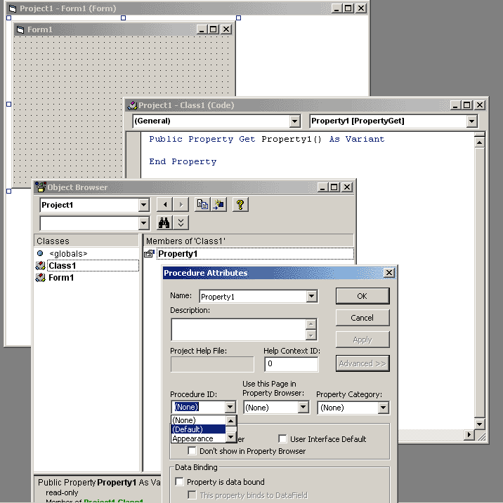



## Default functions and properties

### Description

Make a function or a property the default function or property for that object.
 
### More Info
 

             |
---                |---
**Submitted On**   |
**By**             |[Jon Davis](https://github.com/Planet-Source-Code/PSCIndex/blob/master/ByAuthor/jon-davis.md)
**Level**          |Intermediate
**User Rating**    |4.8 (19 globes from 4 users)
**Compatibility**  |VB 6\.0
**Category**       |[Coding Standards](https://github.com/Planet-Source-Code/PSCIndex/blob/master/ByCategory/coding-standards__1-43.md)
**World**          |[Visual Basic](https://github.com/Planet-Source-Code/PSCIndex/blob/master/ByWorld/visual-basic.md)
**Archive File**   |

### Source Code

It's easy to set specific procedures as default. For instance, if you have a custom collection object and you wish to make the "Item" procedure the default procedure so that "Item" does not have to be referenced (e.g. "MyCollection(key)" rather than "MyCollection.Item(key)"), it can be done. It's really very simple!

To make a function or a property the default function or property for that object, simply open up the object browser, locate the procedure by name, right-click on the procedure name, choose "Properties", expand the "Advanced >>" settings, and rename the Procedure ID to "(Default)".

See the screenshot for a demonstration.

